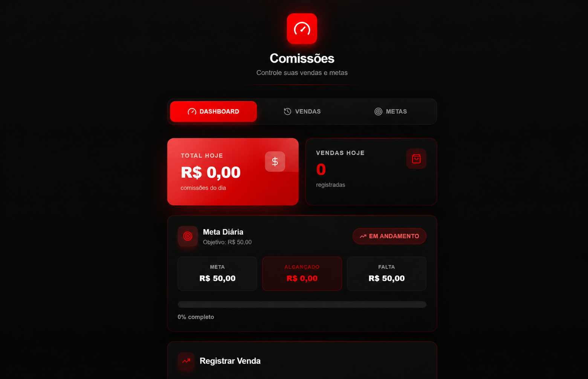
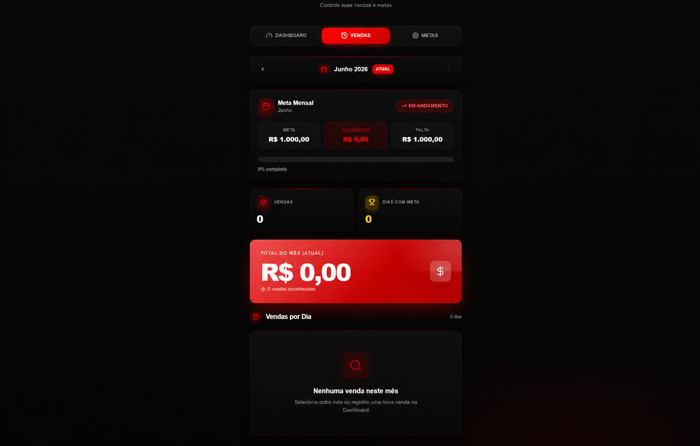
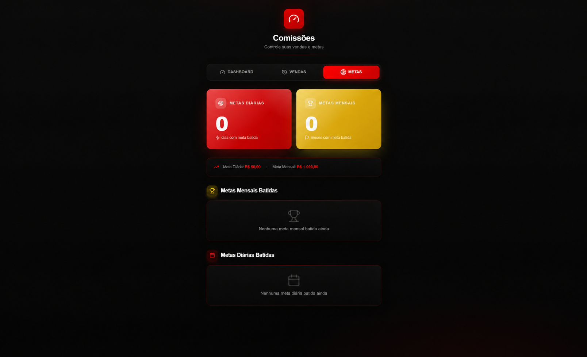

# Vendas e metas

Aplicação web para registrar vendas, calcular comissões e acompanhar metas diárias e mensais.

## Sobre esta versão

Cópia independente para portfólio, com histórico novo. Não está conectada à aplicação em produção nem à sincronização do Lovable. Os arquivos de ambiente, identificadores do projeto de produção e dados de acesso não foram incluídos.

## Funcionalidades

- Cadastro e edição de vendas.
- Cálculo de comissão por produto.
- Acompanhamento de metas e indicadores.
- Histórico de vendas e fechamentos mensais.
- Cadastro de produtos recorrentes para agilizar registros.

## Tecnologias

React, TypeScript, Vite, Tailwind CSS, shadcn/ui e Supabase (PostgreSQL).

## Telas do sistema

> Capturas fornecidas pelo autor e editadas para demonstração. Os valores das metas e o período exibido são fictícios. As telas mantêm o estado sem registros e não representam resultados reais.

### Dashboard e meta diária

Resumo das comissões e vendas do dia, com acompanhamento da meta diária.



### Vendas e acompanhamento mensal

Seleção do mês, progresso da meta mensal, indicadores e área de consulta das vendas por dia.



### Metas e conquistas

Resumo das metas diárias e mensais atingidas, com áreas para consultar o histórico de conquistas.



## Executar localmente

Pré-requisitos: Node.js, npm e um projeto Supabase de teste.

```bash
git clone https://github.com/brunoYves22/metasbruno-portfolio.git
cd metasbruno-portfolio
npm install
cp .env.example .env.local
npm run dev
```

No Windows, copie `.env.example` para `.env.local` pelo Explorador ou com `Copy-Item .env.example .env.local` no PowerShell.

Preencha as variáveis com os valores do **seu projeto Supabase de teste**:

| Variável | Uso |
| --- | --- |
| `VITE_SUPABASE_URL` | URL do projeto Supabase |
| `VITE_SUPABASE_PUBLISHABLE_KEY` | Chave publicável ou anon do projeto de teste |
| `VITE_SUPABASE_PROJECT_ID` | Identificador do projeto de teste |

Aplique as migrações de `supabase/migrations` no seu banco de teste, em ordem cronológica. `supabase/config.toml` usa um identificador local genérico; configure seu próprio projeto se utilizar a CLI.

As migrações desta versão permitem acesso público às tabelas de demonstração. Execute somente em um banco isolado com dados fictícios. Antes de adaptar para uso real, implemente autenticação e políticas RLS restritas por usuário.

Validação do frontend: `npm run build`. O build não configura nem valida o banco de dados.

## Autor

[Bruno Yves Monteiro de Paula](https://www.linkedin.com/in/bruno-yves-monteiro-de-paula-923aa93b4/)
